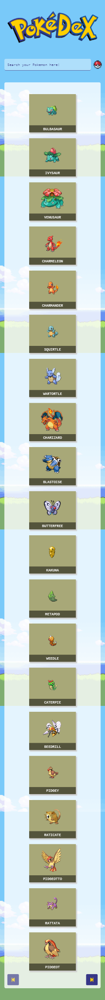

# Pokedex

Catálogo Pokémon; enlista a los Pokemon mostrando 20 por página y además cuenta un buscador que entrega todas las coincidencias con el valor ingresado.

Información por Pokémon:
+ Nombre
+ Nombre en japonés
+ Descripción
+ Imagen
+ Peso
+ Altura
+ Categoría
+ Habilidades
+ Tipos
+ Debilidades

## Vista previa

## Herramientas y Lenguajes
 + [RESTful API Pokéapi](https://pokeapi.co/)
 + Javascript
 + jQuery 3.2.1
 + Bootstrap