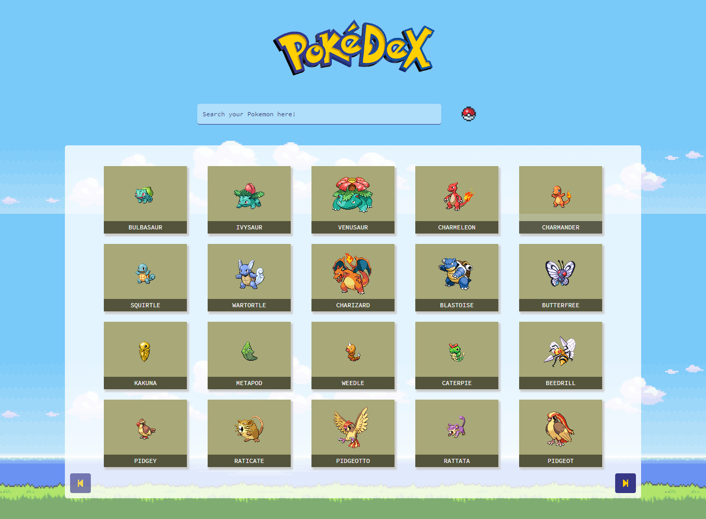
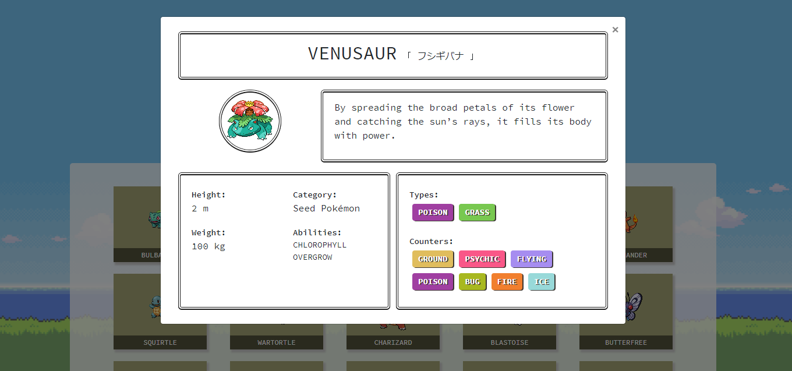
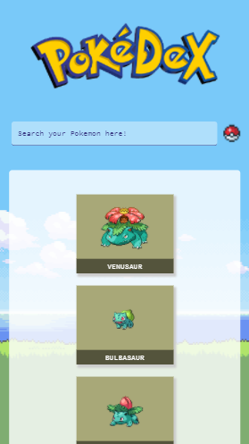

# Pokedex

Catálogo Pokémon; enlista a los Pokemon mostrando 20 por página y además cuenta un buscador que entrega todas las coincidencias con el valor ingresado.

Información por Pokémon:
+ Nombre
+ Nombre en japonés
+ Descripción
+ Imagen
+ Peso
+ Altura
+ Categoría
+ Habilidades
+ Tipos
+ Debilidades

## Herramientas y Lenguajes
 + RESTful API Pokéapi >>> https://pokeapi.co/
 + Javascript
 + jQuery 3.2.1
 + Bootstrap

## Vistas Previas

 ## Desarrollado para 
 + [Laboratoria](http://www.laboratoria.la/)
